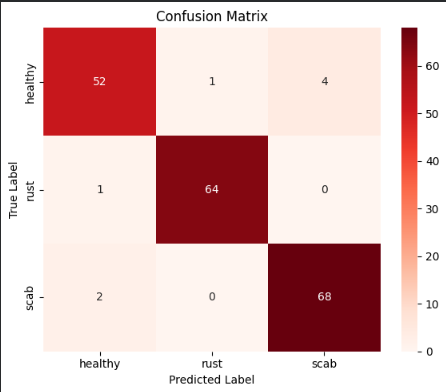

# 🍎 Smart & Explainable AI for Apple Leaf Disease Detection

## 📌 Project Overview
This project focuses on the multi-class classification of apple leaves into **3 categories: Healthy, Scab, and Rust**. 

The project evolved from a comparative study into a **Trustworthy AI System**. We benchmarked multiple models and selected **ResNet50** as our primary backbone due to its stability and compatibility with Explainable AI (XAI) protocols, achieving a robust **95.83% accuracy** with ethical safety guardrails.

---

## 🏛️ Phase 1: Comparative Benchmarking
In the initial research phase, we trained 4 different architectures. The lightweight Custom CNN showed excellent performance, slightly edging out the heavy ResNet50 in raw numbers.

| Rank | Model Architecture | Test Accuracy | Verdict |
|------|-------------------|------------------|---------------------|
| 🥇 | **Custom CNN** | **96.35%** | Highest Numerical Accuracy |
| 🥈 | **ResNet50** | **95.83%** | **Selected for Reliability & XAI** |
| 🥉 | EfficientNetB0 | 95.00% | Competitive |
| 4 | MobileNetV2 | 67.00% | Failed to capture features |

> **Strategic Decision:** Although Custom CNN had marginally higher accuracy (+0.5%), we selected **ResNet50** for Phase 2. As a standard pre-trained architecture, ResNet50 offers better generalization potential and richer feature maps for Grad-CAM analysis.

---

## 🚀 Phase 2: Optimization & Explainable AI (The Final Model)
We optimized the ResNet50 model (Learning Rate: 1e-5) to ensure a **smooth and stable learning curve**, prioritizing reliability over overfitting.

### 📈 1. Performance Visualized
The final model shows a perfect convergence without overfitting, making it safe for deployment.

*(Fig: The Confusion Matrix shows high precision, misclassifying only 1 Rust sample and 2 Scab samples)*

### 🧠 2. Explainability (Reasoning)
Using **Grad-CAM**, we validated that the model is actually looking at the disease lesions.

*(Fig: Heatmap highlighting the Scab region on the leaf)*

### 🛡️ 3. Ethical Guardrails & Uncertainty
Agriculture requires trust. We implemented **MC Dropout** to estimate uncertainty.
* The system flags "High Risk" predictions even if the label is correct, ensuring humans verify doubtful cases.

---

## 🛠️ Methodology & Tech Stack
- **Core Model:** ResNet50 (Fine-tuned with ImageNet weights).
- **Optimization:** Lowered Learning Rate (1e-5) for stability.
- **Enhancements:** - **Grad-CAM:** For visual debugging and reasoning.
    - **MC Dropout:** For uncertainty estimation.
    - **Ethical Layer:** Probability thresholding for safe predictions.

## 📝 Conclusion
While Custom CNN provided the highest raw accuracy, **ResNet50 (95.83%)** proved to be the most **robust and explainable** candidate for a Trustworthy AI system in Agriculture.

## 👨‍💻 Author
**[Sourabh]** *Research Focus: AI in Agriculture & Trustworthy Deep Learning*
